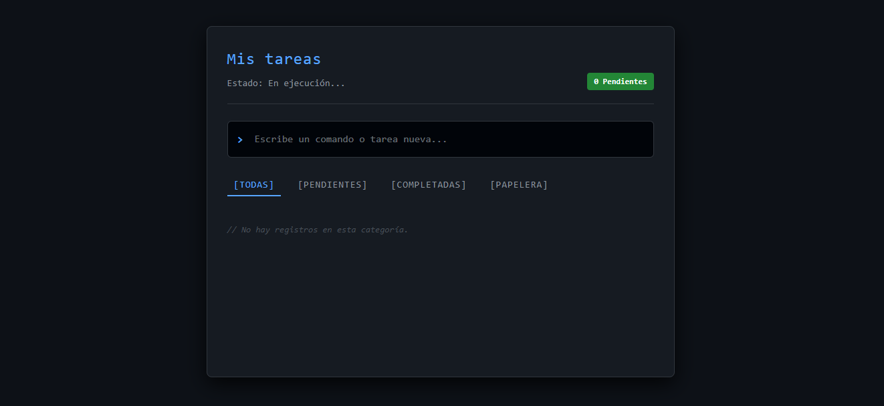

# Gestor de Tareas (TODO List) - Terminal Edition

Aplicación web desarrollada con React y Next.js para la gestión eficiente de tareas diarias.

## Integrantes del Equipo
* **Jhostin Ortiz** - (Desarrollador Individual)

# Funcionalidades Principales (CRUD)
*Crear: Agrega nuevas tareas escribiendo y presionando la tecla Enter.

*Leer y Filtrar: Visualiza todas tus tareas organizadas en pestañas de filtrado ([todas], [pendientes], [completadas]).

*Actualizar (Estado): Marca las tareas como completadas haciendo clic en la casilla.

*Actualizar (Edición): Haz clic sobre el texto de cualquier tarea para editarla al instante con autoguardado inteligente.

*Eliminar (La Papelera): Al presionar el botón de eliminar (X), la tarea se remueve de la lista activa y se transfiere automáticamente a la pestaña [papelera], registrando la hora exacta en la que fue borrada.

## Instalación y Ejecución

Para correr este proyecto en tu entorno local, sigue estos pasos:

1. Clona este repositorio o descarga el código fuente.
2. Abre la terminal en la carpeta del proyecto e instala las dependencias:
   ```bash              
   npm run dev
## Interfaz Visual

